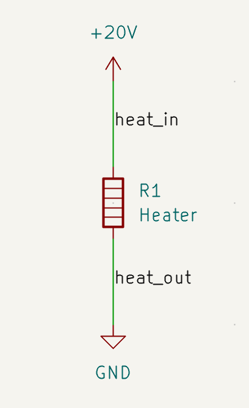
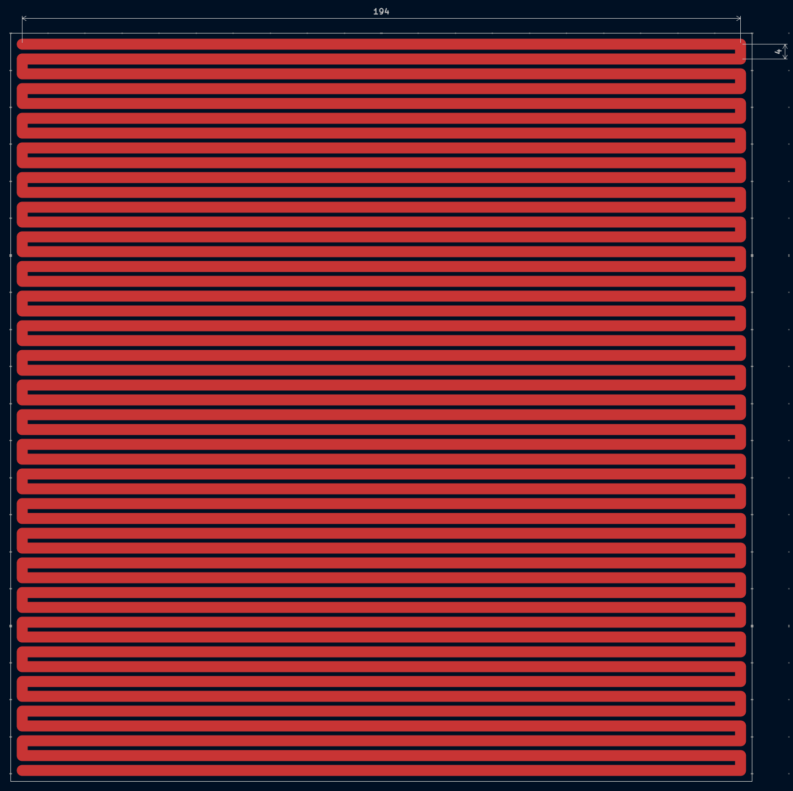
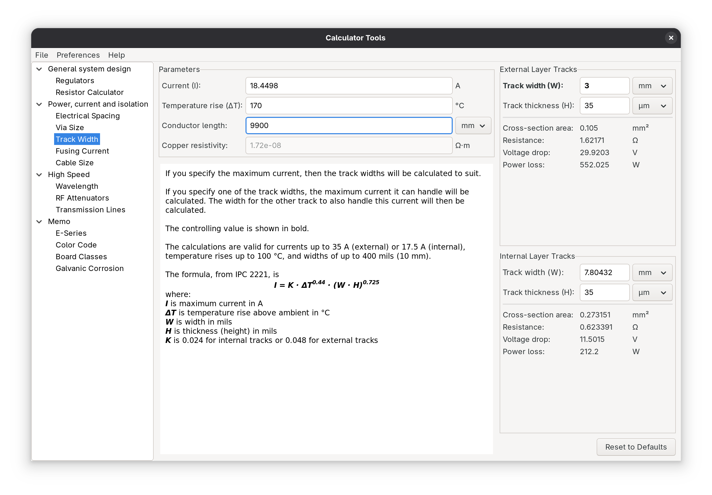
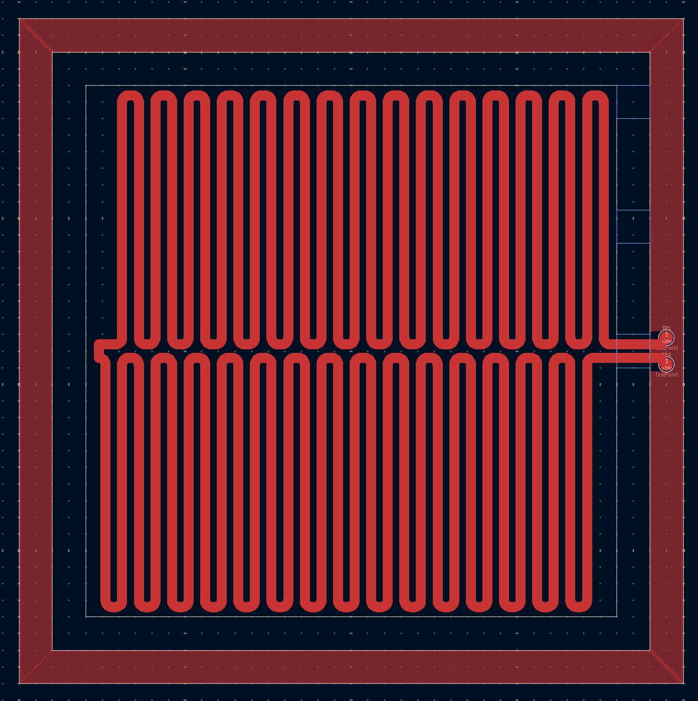
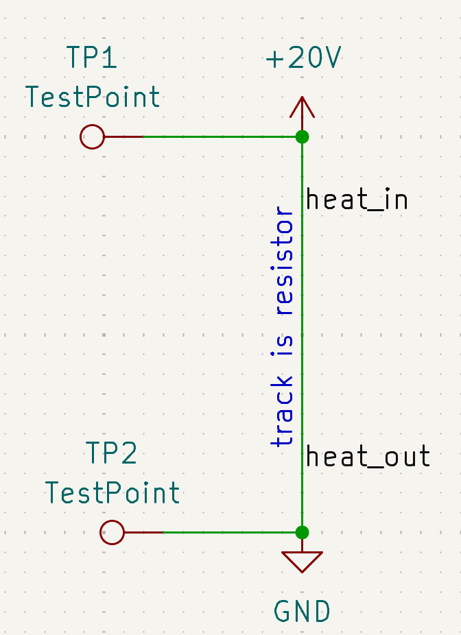
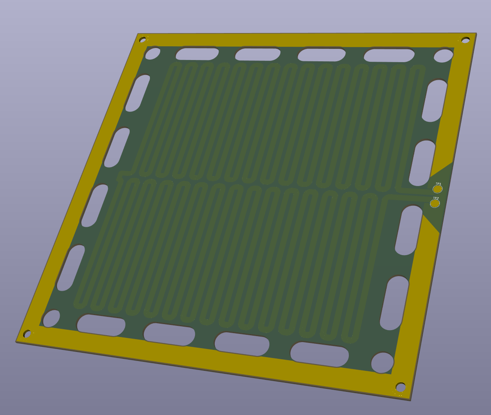

# Soldery

## 2025-06-08

### Why?

I really want to be able to solder boards faster, I currently only have a soldering iron, which works for most SMD components, but *barely*(?) works for chips like the RP2040, and not at all for any BGA chips.

I looked at buying a hotplate online (boring!), and all the ones I could find were:
- too small for the size of my boards
- too expensive

Naturally, I did a Google search to see if there were any existing DIY hotplates I could take inspiration from:
- [DIY-USB-PD-Powered-MCH-Automatic-Reflow-Hotplate-O](https://www.instructables.com/DIY-USB-PD-Powered-MCH-Automatic-Reflow-Hotplate-O/) which used USBC-PD and a Metal Ceramic Heater.
- [Tim's Hot Palate](https://www.instructables.com/Tims-Hot-Plate/) using wall AC and a 300W PTC heating element.

After some deliberation, I came up with a plan:
- Make my own heating element using an aluminium PCB (so it can be as big as I want!)
- Make a seperate control board using an rp2040
- Make it USB-PD powered for ultimate portability

### Hotplate

I need to design the hotplate somewhat quickly because it will take a long time to ship, and if it doesn't work I need to be able to make another revision quickly.

I created a new KiCAD project, and created a schematic for reference.

I created a new 200x200mm PCB with a 3mm track width, and 50 horizontal lines.

And I used the PCB calculator to find out the resistance. 

I realised that a PCB with only traces was a bad idea due to dificulty mounting and soldering to, so I decided on an alternative design inspired by ref2.
This means an outer ring of exposed copper, and an inner square of traces, connected in a few points to the outer ring.
This means that I can place all the mounting points on the outer ring, at low temperature, and still have a high-temperature inner square to reflow with.
I used KiCAD's "Tune lenghth of a single track" function to generate the curves this time, instead of doing it manually like the previous design.

And a new schematic, to give my traces a single net to stop DRC from trying to keep + and - seperate.

This is currently only somewhat half-finished, but it is pretty late right now, so I will continue this tommorrow.

### Reference:
- 1 [https://www.youtube.com/watch?v=dy9NutXl2OY](https://www.youtube.com/watch?v=dy9NutXl2OY)
- 2 [https://www.youtube.com/watch?v=ZChSbpBbrt4](https://www.youtube.com/watch?v=ZChSbpBbrt4)
- 3 [https://www.youtube.com/watch?v=fbBXPeC-FPQ](https://www.youtube.com/watch?v=fbBXPeC-FPQ)
- 4 [https://www.youtube.com/watch?v=kcmpGbR6xZc](https://www.youtube.com/watch?v=kcmpGbR6xZc)

## 2025-06-09

### Hotplate

I finished a first draft of the hotplate design!

However, bad news. I've had to put a pause on this project due to safety concerns over making my own resistive heater without a proper workshop.

For now, I'll be working on my [open-rgbw-lightwall](https://github.com/headblockhead/open-rgbw-lightwall) project, but if/when I can, I'll return to this in the future.
